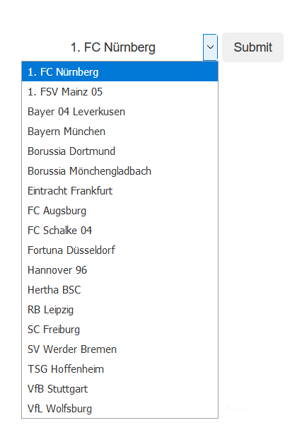
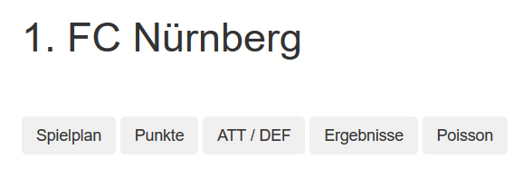
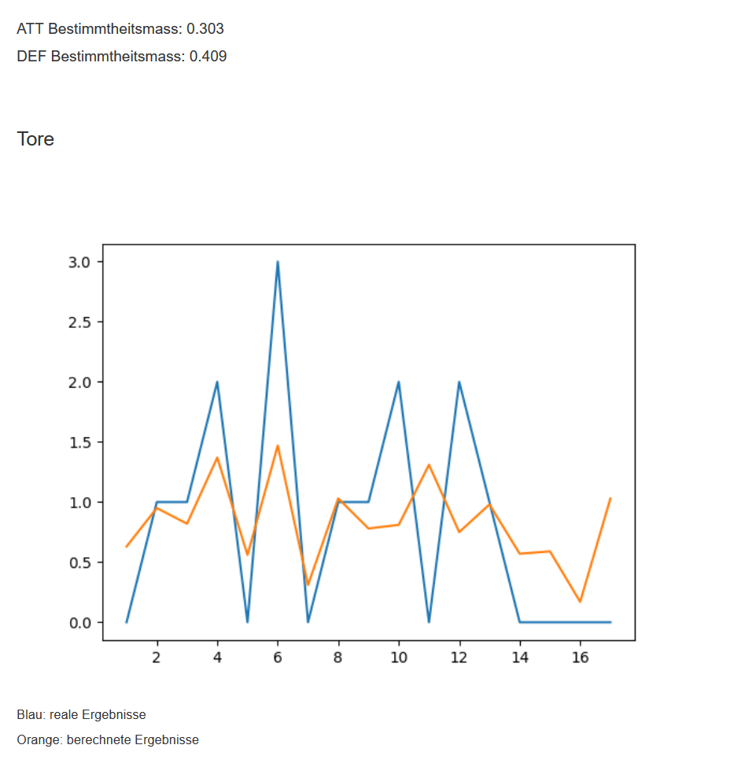

##  Football

This small project can import football results by using a webcrawler and analyse the data in flask.

It was created to learn flask, web crawling, data processing and data visualization.  


### Features

- flask generate an interactive GUI environment
- extract the soccer results from the official DFB-website (https://www.dfb.de/index/)
- format and save the data in CSV-files automatically
- get season overviews 
- create dynamic data diagrams
- calculate the attack/defence value of each club and try to predict the results (based on poisson)
- compare the predicted and real results by using the coefficient of determination (R²)

------------
------------
------------

### First Steps: 

#### Import results

- open ```main.py``` and choose the url for a league

- run:
```
GET_ALL(url)
```

- results will save in a CSV-file automatically (folder: CSV) 

</br>

#### Select a data source 

- open ```main.py``` and select the CSV-file you want to work with

------------
------------
------------

### GUI

start ```START_Gui.py``` (default IP: 127.0.0.1:5000)

###### choose a club in the dropdown menu:



###### now you can switch between the options and analyse the data:



</br>

------------

#### Example calculation:

</br>




